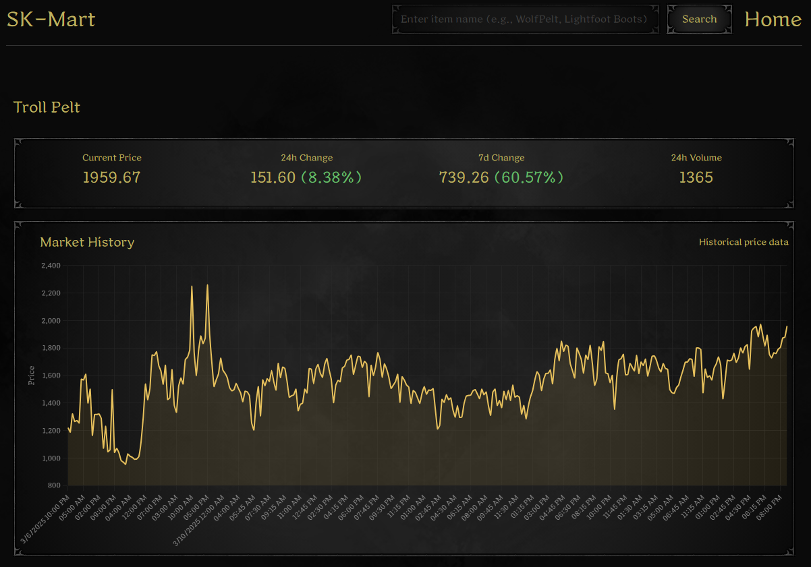

# SK Mart - Market Analytics for Dark and Darker via [DarkerDB](https://darkerdb.com)

<p align="center">
  
</p>

## Features

- Live market feed showing current listings
- Detailed price history charts with multiple time intervals (5m, 15m, 30m, 1h, 4h)
- Statistical analysis including price changes (24h, 7d), volume, and trends

## Usage Notes
This currently only really works for items that do not have rolls/modifiers. Fleshing out a system for organizing price history for each piece of gear is potentially opinionated and more importantly, complex. I started to flesh out Gear + Rarity as a bare minimum but have since moved onto some other projects so I wanted to release this as is.

## Tech Stack

- React.js
- Chart.js for data visualization
- RESTful API integration
- Utilizing [Netlify Functions](https://www.netlify.com/platform/core/functions/)

## Installation

1. Clone the repository:
   ```
   git clone https://github.com/yourusername/sk_mart.git
   cd sk_mart
   ```

2. Install dependencies:
   ```
   npm install
   npm install netlify
   ```

3. Start the development server:
   ```
   npm netlify
   ```

4. Open your browser and navigate to `http://localhost:3000`

## API Credits

This project utilizes market data from [DarkerDB](https://darkerdb.com), all market data is sourced through their API.
